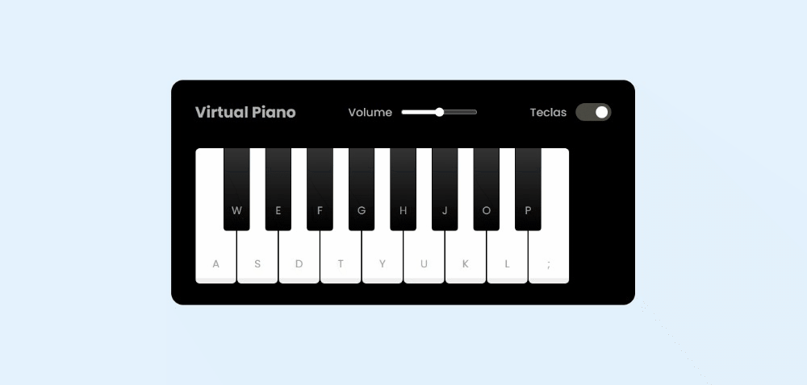

# Web-Piano-Simulator

*Web-Piano-Simulator* é um **simulador web de piano** que permite aos usuários explorar suas habilidades musicais de maneira divertida e interativa. Desenvolvido em HTML, CSS e JavaScript, este projeto oferece uma experiência musical diretamente no navegador. Os usuários podem tocar as notas clicando nas teclas virtuais ou utilizando atalhos no teclado, tornando o aprendizado de música acessível e agradável para todos.

### Resultado

